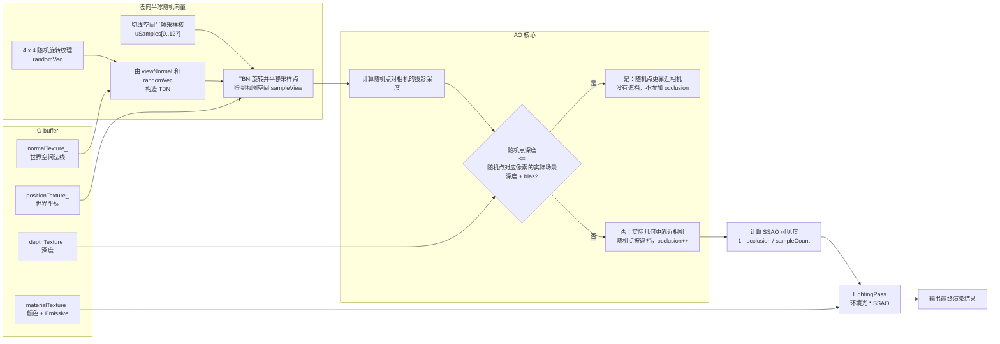

# SSAO Renderer

Headless OpenGL core-profile renderer for the GAMES101 final project. It uses deferred
rasterization, a rectangular area light approximated by point lights, one
2D shadow map per sampled point light, Blinn-Phong lighting model.

## SSAO Flow



## Pipeline

The complete execution tree follows the current code path.

```cpp
// Parse and validate command-line renderer configuration.
main(int argc, char** argv) -> int status
|-- parseAppConfig(argc, argv) -> AppConfig config
|
|   // Create the renderer and drive the full frame pipeline.
`-- Renderer::render(config) -> void
    |
    |   // Set up a headless macOS CGL context and initialize GLEW.
    |-- OpenGLHelpers::Context() -> Context context
    |   |-- CGLChoosePixelFormat(attrs) -> CGLPixelFormatObj
    |   |-- CGLCreateContext(pixelFormat) -> CGLContextObj
    |   |-- CGLSetCurrentContext(context)
    |   `-- glewInit() -> GLenum
    |
    |   // Load scene JSON, upload meshes, and sample the area light.
    |-- Scene::Scene(config) -> Scene scene
    |   |-- Json::parse(input) -> json root
    |   |-- readObjects(root, modelDir) -> vector<SceneObject>
    |   |-- readCamera(root) -> SceneCamera
    |   |-- readAreaLight(root) -> RectAreaLight
    |   |-- readShadowSettings(root) -> ShadowSettings
    |   |-- uploadMeshes(objects) -> vector<GpuMesh>
    |   |   |-- loadObjMesh(path, color, offset) -> vector<Vertex>
    |   |   `-- GpuMesh(name, vertices, emissive)
    |   |       |-- create VAO and VBO
    |   |       |-- upload interleaved vertex data
    |   |       `-- configure position, normal, and color attributes
    |   `-- sampleAreaLight(areaLight, samplesPerSide) -> vector<PointLight>
    |
    |   // Scene-provided settings override the command-line defaults.
    |-- copy area-light, shadow, ambient, and intensity settings into config
    |
    |   // Allocate the geometry attachments used by later screen-space passes.
    |-- GeometryBuffer(width, height) -> GeometryBuffer geometryBuffer
    |   |-- positionTexture_ -> RGB32F world position
    |   |-- normalTexture_ -> RGB16F world normal
    |   |-- materialTexture_ -> RGBA16F albedo and emissive flag
    |   `-- depthTexture_ -> DEPTH_COMPONENT24 camera depth
    |
    |   // Allocate one ambient-visibility value per screen pixel.
    |-- SSAOBuffer(width, height) -> SSAOBuffer ssaoBuffer
    |   `-- texture_ -> R16F ambient visibility
    |
    |   // Allocate the HDR target that accumulates the final lighting result.
    |-- LightingBuffer(width, height) -> LightingBuffer lightingBuffer
    |   `-- texture_ -> RGBA32F accumulated color
    |
    |   // Construct each pass and compile its GPU shader program.
    |-- ShadowPass(shadowMapSize) -> ShadowPass shadowPass
    |   `-- compile ShadowShaders
    |-- GeometryPass() -> GeometryPass geometryPass
    |   `-- compile GeometryShaders
    |-- SSAOPass() -> SSAOPass ssaoPass
    |   |-- compile SSAOShaders
    |   |-- generate kernel_[0..127]
    |   |-- generate 4 x 4 random XY rotations
    |   `-- upload noiseTexture_
    |-- LightingPass() -> LightingPass lightingPass
    |   |-- compile LightingShaders
    |   `-- create FullscreenTriangle
    |-- RenderOutputWriter() -> RenderOutputWriter outputWriter
    |
    |   // Render one depth texture for each point light sampled from the area light.
    |-- shadowPass.render(scene) -> vector<ShadowMap> shadowMaps
    |   `-- for each PointLight
    |       |-- ShadowMap(shadowMapSize) -> ShadowMap
    |       |   |-- create DEPTH_COMPONENT24 texture
    |       |   `-- attach depth texture to shadow framebuffer
    |       `-- ShadowMap::render(meshes, shader, lightPosition, settings)
    |           |-- makeLightViewProjection(lightPosition, settings)
    |           |-- bind and clear shadow framebuffer
    |           `-- draw each non-emissive mesh into the depth texture
    |
    |   // Rasterize the scene once and fill every G-buffer attachment.
    |-- geometryPass.render(config, scene, geometryBuffer) -> void
    |   |-- geometryBuffer.bind() -> void
    |   |-- makeView(scene.camera) -> Mat4 view
    |   |   `-- lookAt(position, target, up) -> Mat4
    |   |-- makeProjection(scene.camera, config) -> Mat4 projection
    |   |   `-- perspective(fovY, aspect, near, far) -> Mat4
    |   |-- upload view and projection uniforms
    |   `-- draw each scene mesh
    |
    |   // Build the camera matrices used to evaluate SSAO in view space.
    |-- lookAt(camera.position, camera.target, camera.up) -> Mat4 view
    |-- perspective(fovY, aspect, near, far) -> Mat4 projection
    |
    |   // Evaluate ambient visibility for every visible screen pixel.
    |-- if config.enableSSAO
    |   `-- ssaoPass.render(ssaoBuffer, geometryBuffer, view, projection, width, height)
    |       |-- ssaoBuffer.bind() -> void
    |       |-- bind G-buffer position, normal, and depth textures
    |       |-- bind the 4 x 4 random rotation noise texture
    |       |-- upload view, projection, radius, bias, near/far, and screen size
    |       |-- upload kernel_[0..127] -> uSamples[0..127]
    |       `-- fullscreenTriangle_.draw() -> void
    |           `-- rasterize fullscreen triangle
    |               `-- for each covered screen pixel / fragment
    |                   `-- execute SSAO fragment shader
    |                       |-- read current hardware depth
    |                       |   `-- background -> write visibility 1.0
    |                       |-- read world position and world normal
    |                       |-- transform position and normal into view space
    |                       |-- read randomVec and build TBN
    |                       |-- for each hemisphere sample i in [0, 127]
    |                       |   |-- calculate sampleView
    |                       |   |-- project sampleView -> sampleUV
    |                       |   |-- read and linearize scene depth at sampleUV
    |                       |   |-- calculate rangeCheck
    |                       |   `-- if scene depth < random-point depth - bias
    |                       |       `-- occlusion += rangeCheck
    |                       |-- visibility = 1.0 - occlusion / 128.0
    |                       |-- visibility = pow(visibility, 3.0)
    |       `-- write oSSAO = visibility -> ssaoBuffer R16F
    |
    |   // Disabling SSAO keeps the ambient-light multiplier neutral.
    |-- else
    |   `-- ssaoBuffer.clearNeutral() -> fill visibility with 1.0
    |
    |   // Accumulate deferred lighting from every sampled point light.
    |-- lightingPass.render(config, scene, shadowMaps, geometryBuffer, ssaoBuffer, lightingBuffer)
    |   |-- bind lightingBuffer and all G-buffer and SSAO textures
    |   |-- upload camera position, ka, kd, ks, and light intensity
    |   |-- set uShininess = 32.0
    |   |   `-- retain the Blinn-Phong model but treat Cornell Box surfaces as diffuse
    |   `-- for each PointLight i
    |       |-- configureAccumulation(i == 0)
    |       |   |-- first light -> disable blending and write the base result
    |       |   `-- later lights -> additive blending with GL_ONE + GL_ONE
    |       |-- bindLight(light[i], shadowMaps[i], lightCount, i == 0)
    |       |   |-- bind the point light's shadow depth texture
    |       |   |-- upload light position, color, and light view-projection matrix
    |       |   `-- uInvLightCount = 1.0 / lightCount
    |       `-- fullscreenTriangle_.draw()
    |           `-- rasterize fullscreen triangle
    |               `-- for each covered screen pixel / fragment
    |                   `-- execute Blinn-Phong shader for this pixel and PointLight i
    |                       |-- read depth, worldPosition, normal, albedo, and emissive flag
    |                       |-- background -> write background color only on the first light
    |                       |-- emissive surface -> write albedo only on the first light
    |                       |-- L_i = normalize(light[i].position - worldPosition)
    |                       |-- V = normalize(cameraPosition - worldPosition)
    |                       |-- H_i = normalize(L_i + V)
    |                       |-- diffuseFactor_i = max(dot(N, L_i), 0.0)
    |                       |-- specularFactor_i = pow(max(dot(N, H_i), 0.0), shininess)
    |                       |-- pointShadow(worldPosition, N, shadowMaps[i]) -> shadow_i
    |                       |   `-- compare this pixel against light i's shadow map -> 0.0 or 1.0
    |                       |-- ambient = albedo * ka * SSAO
    |                       |   `-- add ambient only during the first light pass
    |                       |-- diffuse_i = albedo * kd * light[i].color * diffuseFactor_i
    |                       |-- specular_i = ks * light[i].color * specularFactor_i
    |                       |-- direct_i = (diffuse_i + specular_i) * shadow_i * lightIntensity / lightCount
    |                       `-- add direct_i; add ambient only when i == 0
    |
    |   // Read the render targets and write final and debug images.
    `-- outputWriter.write(config, geometryBuffer, ssaoBuffer, lightingBuffer)
        |-- LightingBuffer::writeColor(config.colorOutput)
        |-- GeometryBuffer::writeNormalDebug(config.normalOutput)
        |-- GeometryBuffer::writeDepthDebug(config.depthOutput)
        `-- ssaoBuffer.writeDebug(config.ssaoOutput)
```

## Render Data

G-buffer: position `RGB32F`, normal `RGB16F`, material `RGBA16F`, depth `D24`.
SSAO buffer: `R16F` visibility per pixel (1.0 = fully visible). SSAO parameters
(128 samples, `4×4` noise, radius 60, bias 0.5, near/far 10/2000, cubic
contrast) are currently hardcoded in `SSAOPass`.

## Area Light And Shadows

The rectangular area light is defined by `origin`, `edge_u`, and `edge_v`.
`area_light_samples = N` places one point light at the center of each cell in
an `N x N` grid, producing `N^2` point lights.

Each point light owns one conventional 2D perspective shadow map aimed at the
configured shadow target. During lighting, one fullscreen pass is evaluated
for each point light. For a given pixel and light `i`, `shadow_i` is the binary
depth-comparison result from `shadowMaps[i]`. The renderer adds all
point-light contributions after dividing each one by `lightCount`, so different
lights can disagree on visibility and produce a soft area-light penumbra after
accumulation.

This is not a cubemap shadow implementation. It assumes the sampled ceiling
lights illuminate the scene in the direction covered by the configured shadow
camera.

## Lighting Model

The shader retains the Blinn-Phong terms for each pixel and point light i:

```text
L_i = normalize(lightPosition_i - worldPosition)
V   = normalize(cameraPosition - worldPosition)
H_i = normalize(L_i + V)

diffuse_i  = albedo * kd * lightColor_i * max(dot(N, L_i), 0)
specular_i = ks * lightColor_i
             * pow(max(dot(N, H_i), 0), shininess)
direct_i   = (diffuse_i + specular_i) * shadow_i
             * lightIntensity / lightCount
ambient    = albedo * ka * SSAO
```

Current defaults: `shininess = 32`, `ks = 0` (diffuse-only).
Ambient written only in the first light pass; later passes use additive
blending (`GL_ONE, GL_ONE` for RGB, `GL_ZERO, GL_ONE` for alpha).

## Code Structure

- `Renderer`: contains only top-level resource creation and pass ordering.
- `Scene`: owns parsed scene settings, uploaded meshes, and sampled lights.
- `ShadowPass`: creates and renders the per-light shadow maps.
- `GeometryPass`: rasterizes scene meshes into the G-buffer.
- `SSAOPass`: generates the hemisphere kernel/noise texture and evaluates
  screen-space visibility from the G-buffer.
- `LightingPass`: owns deferred lighting, texture binding, and light accumulation.
- `RenderOutputWriter`: writes final color and debug attachments to disk.
- `OpenGLHelpers`: owns the headless context type and OpenGL error checking.
- `GeometryBuffer`: owns position, normal, material, and depth attachments.
- `SSAOBuffer`: owns the single-channel SSAO visibility attachment.
- `LightingBuffer`: owns the final HDR color attachment.
- `FramebufferSupport`: internal texture, FBO validation, and
  PPM helpers shared by the buffer implementations.
- `FullscreenTriangle`: shared draw primitive for screen-space passes.
- `GeometryShaders`, `SSAOShaders`, `LightingShaders`, and `ShadowShaders`:
  shader sources grouped by their owning pass.
- `ShadowMap`: depth target and rendering for one sampled point light.
- `ShaderProgram`: shader compilation, linking, and uniform helpers.
- `GpuMesh`: owns one mesh VAO and VBO.

## Scene Configuration

Each model directory contains OBJ meshes and one `scene.json`. The renderer
uses the model-directory basename as the output-directory name. No
scene-specific C++ source is required.

The scene file contains:

- `camera`: position, target, up vector, vertical FOV, near plane, and far plane;
- `area_light`: rectangular light origin, two edge vectors, and color;
- `shadow`: target, up vector, vertical FOV, near plane, and far plane;
- `objects`: relative OBJ path, albedo, optional position offset, and optional
  emissive flag;
- `area_light_samples`: point-light grid resolution per side;
- `shadow_map_size`: width and height of every point-light shadow map;
- `ka`: ambient coefficient (default 0.2);
- `kd`: diffuse coefficient (default 1.0);
- `ks`: specular coefficient (default 0.0);
- `light_intensity`: global direct-light multiplier.

The included scenes are `models/cornellbox` and `models/ssao-demo`. The latter
contains additional geometry intended to make SSAO contact shadows easier to
inspect.

## Build and Render

Dependencies:

- CMake 3.16 or newer
- a C++17 compiler
- OpenGL
- GLEW
- nlohmann-json
- `sips` for the PNG conversion performed by `render.sh`

The headless context implementation currently uses macOS CGL. Other platforms
need a platform-specific context implementation before the renderer can run.

On macOS with Homebrew:

```sh
brew install cmake glew nlohmann-json
./render.sh
```

`render.sh` configures CMake, builds `SSAO_Renderer`, renders the model selected
near the top of the script, and overwrites `build/<scene>/render.png` with the
latest result. Script variables:

```bash
WIDTH=2560
HEIGHT=1440
MODEL_DIR="$ROOT_DIR/models/ssao-demo"
ENABLE_SSAO=1        # set to 0 to disable SSAO
```

Lighting and quality settings (`ka`, `kd`, `ks`, `area_light_samples`,
`shadow_map_size`, `light_intensity`) live in each scene's `scene.json`.
All executable options below also work as CLI overrides, e.g.
`./render.sh --ka 0.5 --no-ssao`.

Executable options are case-sensitive:

```text
--width N
--height N
--area-light-samples N
--shadow-map-size N
--ka value
--kd value
--ks value
--light-intensity value
--model-dir path
--output path
--normal-output path
--depth-output path
--ssao-output path
--no-ssao
--help
-h
```

The six scene-level settings are read from `scene.json` and can be temporarily
overridden via CLI flags above. Output options select filenames only; all images
are placed under `build/<scene>/`.

## Outputs

- `build/<scene>/render.ppm`: final deferred-lighting result.
- `build/<scene>/render.png`: PNG conversion of the final result.
- `build/<scene>/normal_debug.ppm`: encoded world-space G-buffer normals.
- `build/<scene>/depth_debug.ppm`: normalized depth visualization.
- `build/<scene>/ssao_debug.ppm`: grayscale SSAO visibility, where darker
  pixels are more occluded.

PPM files are written directly by the renderer. `render.sh` additionally uses
`sips` to convert the final default `render.ppm` into `render.png`. Re-running
the renderer overwrites outputs with the same names.

## SSAO Tuning

Parameters are in `src/SSAOPass.cpp`:

| Parameter | Default | Effect |
|---|---|---|
| `uRadius` | 60 | Sampling radius in view-space units. Larger → wider occlusion. |
| `uBias` | 0.5 | Depth-comparison tolerance. Smaller → more sensitive. |
| Sample count | 128 | More samples → less noise but slower. |
| `pow(x, 3.0)` | 3.0 | Contrast boost. Higher → darker corners, more stylised. |

To compare SSAO on/off: `./render.sh` vs `./render.sh --no-ssao`, or set
`ENABLE_SSAO=0` in `render.sh`. Check `ssao_debug.ppm` for raw occlusion.

## Adding a Scene

1. Create `models/<name>/` with OBJ meshes and a `scene.json`.
2. Copy the JSON structure from `models/ssao-demo/scene.json`.
3. `"mesh"` paths are relative to the scene directory.
4. Set `MODEL_DIR="$ROOT_DIR/models/<name>"` in `render.sh` (or pass `--model-dir`).
5. Run `./render.sh` — outputs land in `build/<name>/`.

No C++ changes needed.
